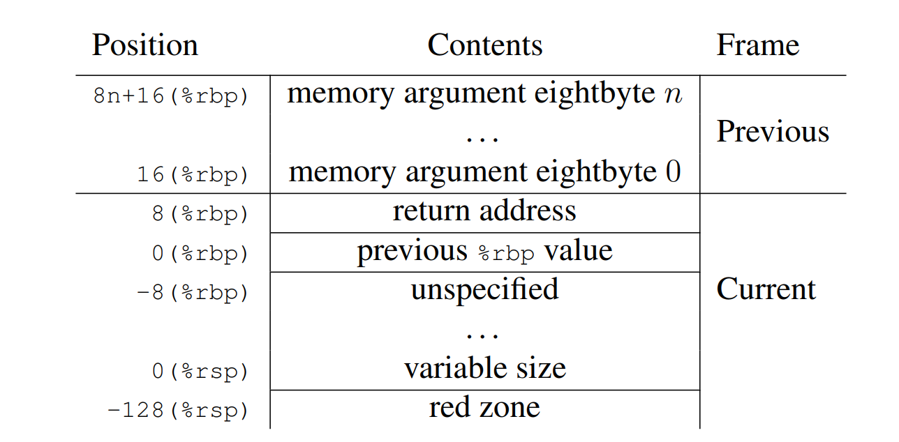

# 栈回溯

栈回溯是一项核心功能。其重要性不仅在于对于调试起帮助，更在于在动态执行的程序中判断当前系统调用的上下文，或者语义，whatever。

试想，Tracee 中有多处调用了某系统调用，而我们仅仅希望在某一处调用时注入错误，而其他地方并不注入。如果是代码插桩的话，这件事情就相对简单。如果是通过 ptrace 控制，这些系统调用发生时，直接获得的只有系统调用号与参数等寥寥无几的信息。因此，需要想办法搞清楚调用发生的具体位置。


## 最 Naive 的 stack unwinder

根据 [x86_64 System V ABI](https://gitlab.com/x86-psABIs/x86-64-ABI/-/jobs/artifacts/master/raw/x86-64-ABI/abi.pdf?job=build)，这是函数调用发生时典型的栈布局：



一般而言，所有函数都需要在最开头做：

```assembly
push %rbp
mov  %rsp, %rbp
sub  $N, %rsp        ; 分配局部变量空间
```

编译器一般会默认做这件事。这意味着我们可以通过`%rbp => *(%rbp) => **(%rbp) => ***(%rbp) => ...` 这条链来进行栈回溯，得到每次的返回地址。


## 从返回地址到函数名

在最简单的情况下，我们完全可以通过反编译来确定地址在程序中的哪个函数里。

> 真的吗？如果开了地址空间随机化呢？

打开了地址空间随机化之后，二进制文件的代码段会被随机映射到某个地址位置。如果此处得到了 %rip，我们勉强还是可以通过内存映射表找到映射前的地址，从而分析出函数名。方便起见，设计的时候就已经假设关闭地址空间随机化了。这对于一个用于测试的环境来说，应该是一个非常合理的要求。

事实上，我们有太多的手段可以分析出函数名了，也许是 libelf 这类分析二进制文件的库。


## 从地址到文件与行号

在使用 gdb 的时候，如果编译的时候打开 `-g` 选项，那么在 backtrace 的时候，就能看到很多函数所在的文件名与行号；但如果没有打开，就只能看到函数名，以及 `%rip` 相对函数开头的地址偏移量。

文件名与行号其实被记录在二进制文件的调试信息里了。以下为打开 `-g` 的时候会多生成的调试信息段。

| 段名                                      | 说明                                                         |
| ----------------------------------------- | ------------------------------------------------------------ |
| `.debug_info`                             | DWARF 的主结构，描述每个函数/变量的结构和类型                |
| `.debug_abbrev`                           | `.debug_info` 中使用的缩写表（DW_TAG 等）                    |
| `.debug_line`                             | 源码行号到指令地址的映射（GDB 显示源码时使用）               |
| `.debug_str`                              | 存储调试中用到的字符串常量（函数名、变量名等）               |
| `.debug_loc`                              | 变量/参数在栈上或寄存器中的位置描述                          |
| `.debug_aranges`                          | 指令地址到编译单元的映射表（辅助快速查找）                   |
| `.debug_ranges`                           | 表示函数或变量在不连续地址中的范围                           |
| `.debug_frame`                            | 栈展开信息，用于 GDB 回溯调用栈（和 `.eh_frame` 类似但用于调试器） |
| `.debug_macro`                            | 预处理宏定义、展开等信息（GCC ≥ 7）                          |
| `.debug_pubnames`                         | 快速索引函数名（已被 DWARF 5 弃用）                          |
| `.debug_pubtypes`                         | 类型快速索引表（与 pubnames 类似）                           |
| `.debug_addr`                             | 分离地址引用表（DWARF 5）                                    |
| `.debug_ranges.dwo`, `.debug_info.dwo` 等 | 针对分离调试信息（split DWARF）的支持段                      |

在 resolve.cpp 中，实现了分析地址到源文件与行号的功能。

需要注意的是，这里并没有处理**动态链接**的问题。因为这里只分析了 tracee 的可执行文件，而并没有把动态库文件加入分析。


## 丢帧问题

### 概述

在完全静态链接的可执行文件上 （[例子](#1. 复现"丢帧"问题最小示例)），使用 `libunwind‑ptrace` 做远程栈回溯，得到的结果是：

```
#0 __libc_recvfrom
#1 main
```

而实际逻辑调用序列应为：

```
main → poll_msg → recvfrom
```

同一进程在 GDB 中执行 `bt` 却能看到完整链。

### 成因

#### `libunwind` 的查表逻辑与 **两级 fallback**

`unw_step()` 内部主要调用 `_Ux86_64_step()`，流程如下（伪代码）：

```
// ① 是否有缓存的 proc_info？若无：
find_proc_info(ip, &pi) →
    dwarf_find_unwind_table(pid, ip)  // 首选 .eh_frame_hdr 查表
    if (!table)                       // (A) 找不到 FDE
        try_framechain();             // (B) 用 rbp 链 fallback
```

##### `try_framechain()`

- 若当前帧保存了 `%rbp` 且 `%rbp` 指向合法栈区， 则认为 `[rbp]` 存 caller 的 `%rbp`, `[rbp+8]` 存 caller 的 `%rip`；
- 组装一个“人工”上一帧 → `unw_step()` 返回 > 0。

> **因此**：在缺少 FDE 又恰好保留帧指针时，可以继续退到 `main()`，但因为 frameless 函数的存在，会跳过所有 frameless 函数的上一层（如 `poll_msg`）。


编译好的文件是有 `.eh_frame` 段的，甚至于在里面可以找到 `__libc_recvfrom` 这一项。然而 libunwind 显然还是选择了 fallback 策略。这是因为缺少 `PT_GNU_EH_FRAME` 。

- `.eh_frame` 在静态程序里默认是 **SHT_PROGBITS**，不在任何 `PT_LOAD` segment；
- 远程 unwinder 通过读取 `/proc/PID/maps` 里的 segment 首地址 + program‑header，**只能**看到 `PT_*` 指定的段；
- 缺少 `PT_GNU_EH_FRAME` ⇒ 找不到 `.eh_frame_hdr` ⇒ `find_proc_info()` 失败 ⇒ 触发 (B) fallback，仅凭 `%rbp` 链。

### 解决

为链接器加上选项。也就是为 gcc 加上 `-Wl,--eh-frame-hdr`。

`--eh-frame-hdr` 命令让链接器：

1. 复制 `.eh_frame` 并生成一个紧凑索引 `.eh_frame_hdr`；
2. 插入 `PT_GNU_EH_FRAME` program‑header 指向该索引；
3. 由于 `.eh_frame_hdr` 属于可加载 segment，远程进程映射可见；

### 对比

为什么 GDB 能做到？

GDB 全流程简略：

```
DWARF‑CFI   (文件级)  → 成功 → 返回
  │
  ├─ 失败
  ▼
prologue‑sniffer (反汇编) → 若发现 push %rbp/mov %rsp,%rbp → 手算上一帧
  │
  ├─ 失败
  ▼
trad‑rbp‑chain (纯链)
```

因其拥有磁盘 ELF 信息，不依赖 `PT_GNU_EH_FRAME`；即便 CFI 缺失，也可借助 sniffer 过 frameless 函数。

|               | **GDB**                                                      | **libunwind‑ptrace**                             |
| ------------- | ------------------------------------------------------------ | ------------------------------------------------ |
| 可用 ELF 信息 | 在磁盘上打开目标 ELF 与 split‑debug，解析 `.debug_*`, `.eh_frame` **全部 section** | **仅** 读取进程的 Program Header（segment）映射  |
| CFI 首选      | `.debug_frame` → `.eh_frame`                                 | `.eh_frame`（必须先通过 `PT_GNU_EH_FRAME` 找到） |
| 备用策略      | prologue sniffer → rbp‑链 → heuristic                        | rbp‑链（简化版）                                 |

### 快速检查调试信息的命令

```
# 是否包含 PT_GNU_EH_FRAME
readelf -l  a.out | grep EH_FRAME

# 列出 FDE 覆盖 range，不依赖符号
readelf -wf a.out | head

# 检验函数是否有帧指针
objdump -dS a.out | less   # 查找 push %rbp / mov %rsp,%rbp

# 查 libc.a 内部符号及 CFI
ar x /usr/lib/x86_64-linux-gnu/libc.a recvfrom.o
readelf -wf recvfrom.o | head
```


## 杂项

### 编译优化导致的丢帧

如果编译时开了尾递归优化，那么此时栈帧就不会增长。开启 `-fno-optimize-sibling-calls` 可解。

### 内联函数

`-fno-inline -fno-inline-functions -fno-inline-small-functions`

### 编译优化导致栈帧未建立（没有 `push %rbp; mov %rsp, %rbp`)

`-fno-omit-frame-pointer`


如果连编译参数也不能改的话，那么这测试不做也罢。


## 附录

### 1. 复现“丢帧”问题最小示例

```
// demo.c ─── gcc demo.c -static -g -fno-omit-frame-pointer \
//                      -fasynchronous-unwind-tables -o demo 
#include <sys/socket.h>
#include <unistd.h>

__attribute__((noinline,optimize("no-optimize-sibling-calls")))
ssize_t poll_msg(int fd, void *buf, size_t len) {
    return recvfrom(fd, buf, len, 0, NULL, NULL);
}

int main() {
    char b[1];
    poll_msg(0, b, 1);
    return 0;
}
```

#### 编译对比

| 链接选项                    | `libunwind` 结果         | GDB 结果                            |
| --------------------------- | ------------------------ | ----------------------------------- |
| **无** `--eh-frame-hdr`     | `__libc_recvfrom → main` | `__libc_recvfrom → poll_msg → main` |
| **加** `-Wl,--eh-frame-hdr` | 与 GDB 相同              | 相同                                |

