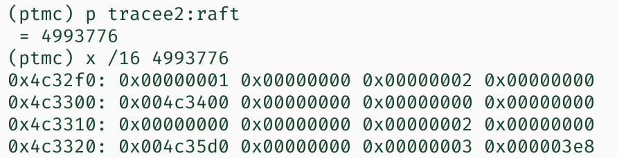

# DetSim 设计

[toc]

## 概述

DetSim 是一个主要面向 x86-64\_Linux 上运行的原生可执行文件的代码级 Model Checker。主要适用于传统编译型语言（C、C++、Rust、Go）编译的程序。

### 特性

- 支持单机模拟分布式系统/并发程序运行
- Stateful：保存程序执行状态，与 Stateless 保存程序执行路径对应
- 执行调度交错粒度可调节：指令级；系统调用级
- 支持自动探索和手动调试模式

### 原理

想法起源于对分布式系统的代码级 Model Checking。分布式系统执行的不确定性主要来源于本地系统调用的不确定结果，以及网络系统调用（消息传递）发生的先后顺序。因而想到，只要将实际产生影响的关键系统调用进行模拟，使其产生各种各样的可能结果，并且控制好各节点的执行调度，即可模拟整个系统的所有可能执行序列。

通过这种方法，在系统发生状态违例的时候，我们就可以清晰地看到每一步执行了什么，以及所有的中间状态。这对于我们找到分布式系统中的 Bug 是有利的。

进一步地，如果将执行操控粒度改为指令级别，并实现对多线程程序的操控，就可以获得一个对并发程序进行模型检测的工具。不过这种方法有其局限性，因为单步执行并发程序隐含了 Strong Memory Model 的假设。

> 每个机器执行指令，默认地包含 acquire、release 语义
> 这意味着，当某个 cpu A 执行一连串的写动作时，对于其他CPU，它们看到的写入顺序应该与A执行的一致。

### 机制

我们将作跟踪的进程称为 Tracer，被跟踪的进程称为 Tracee。由 Tracer 启动 Tracee 并介入跟踪，将每个 Tracee 执行到一个初始状态后停下并对其状态进行保存（称为快照）并将快照入队。之后进入主循环，每次从队列中取出一个快照。对于每一个 Tracee，都恢复这个快照到进程中，并执行一步，再保存快照入队。整个探索过程相当于广度优先搜索，也可以使用其他的探索模式。

每探索到一个全局状态，都进行一次状态检查，以判断整个系统的状态是否违反了规约，并可以打印出到目前为止的执行路径。

### 目标

- 实现易用的调试模式
  - 变量分析，类型推导，表达式运算，更方便的操控方式，友好的信息展示
- 提高自动化程度，尤其是 Choose() 函数的生成
- 提高探索效率；方便地修改探索策略
  - 允许添加自定义的状态结构体，方便进行状态之间的比较
- 利用好 Stateful 可能带来的便利 ~看起来似乎没什么便利~

---


## 关键技术

DetSim 所依赖的主要技术细节，有一些开发过程中需要特别注意的内容。

### 系统调用概述

这里的系统调用有两重含义，一重是位于 Linux Kernel 的 Native Syscall；另一重是 Libc Wrapper。

#### Native Syscall

Linux 发生系统调用是通过 `syscall`  指令（`0x0f 0x05`），根据 `RAX` 寄存器存放的系统调用号以及 `RDI`, `RSI`, `RDX`,`R8`, `R10`, `R9` 六个寄存器存放的参数进行调用，最后将调用结果返回到 `RAX` 寄存器中。

所以，以 `write` 为例，一个系统调用最原本的样子是：

```assembly
.data
s: 
  .ascii "Hello World!\n"
  
.text
// write(1, s, 13)
mov $1, %rax
mov $1, %rdi
mov $s, %rsi
mov $13, %rdx
syscall
```

如果执行成功，返回值（`RAX`）是 13。如果失败的话，`RAX` 中将存放对应的错误号**的相反数**。**错误号均为正数，错误时的返回值均为负数**。

```plain
EPERM 1 Operation not permitted
ENOENT 2 No such file or directory
...
```


#### Libc Wrapper

使用 C 语言进行系统调用时，实际上调用的是 libc 的 wrapper 函数，而不是直接进行系统调用。包括 `read`, `write` 等等，甚至包括：

```c
long syscall(long number, ...);
```

有一些系统调用没有 C wrapper，于是可以使用这个通用的 wrapper 进行间接调用。

Libc wrapper 与 Native syscall 略有不同，主要在于部分函数参数语义变化以及返回值的处理。

##### 函数参数变化：一个典型例子

所举的例子就是 `ptrace` 本身。先来看看 `ptrace` 在 Libc Wrapper 中的函数原型：

```c
long ptrace(enum __ptrace_request op, pid_t pid, void *addr, void *data);
```

对于大多数 `ptrace` 的调用而言，这些参数都是传入的参数，而有一个例外就是 `PTRACE_PEEKDATA/PTRACE_PEEKTEXT`。它的功能是读取目标进程 `addr` 位置的一个*机器字*（64位机的8字节），作为函数的返回值。

这就出现了一个矛盾：`addr` 位置的值有可能是 -1；而 `ptrace` Wrapper 规定在系统调用失败时返回 -1。

对于 Native 的 `ptrace` 调用而言，对于地址内容的返回是通过 `data` 参数进行的，错误码的返回是通过返回值进行的。Wrapper 则希望用户忽略 `data` 参数，因为这个参数会被 Wrapper 使用。

```c
long ptrace(op, pid, addr, data) {
  switch (op) {
    case PTRACE_PEEKDATA: case PTRACE_PEEKTEXT:
      long real_data;
      rval = ptrace_native(op, pid, addr, &real_data);
      if (rval < 0) {
        errno = -rval;
        return -1;
      } else {
        return real_data;
      }
      break;
    case ...
  }
}
```


##### errno：错误情况下的返回值

Libc wrapper 除了将系统调用号和参数放进寄存器，并执行调用以外，还会在调用返回之后设置 `errno(3)`。

```plain
LIBRARY
    Standard C library
SYNOPSIS
	  #include <errno.h>
```

`errno` 是一个 Thread Local 的变量，用于标志系统调用发生的错误类型。对于成功的系统调用，`errno` 不会变化（不会清零）。因此如果需要使用 `errno` 判断是否发生错误，需要提前手动清零；或者就通过系统调用的返回值判断是否发生错误，再去看 `errno`。

Native Syscall 的错误号会反映在 `RAX` 寄存器中；而 Libc Wrapper 系统调用会进行进一步处理，将错误号放在 `errno` 中。

例如，一个 Native `write()` 系统调用实际返回了 `ENOENT 2`，也就是 -2，根据手册：

> On  success, the number of bytes written is returned.  On error, -1 is returned, and errno is set to indicate the error.

Libc Wrapper 的返回值是 -1，而 `errno` 的值将是 2。


### 进程与线程概述

整个系统的出发点是对于分布式系统的执行流进行操控，而这里面就要厘清进程和线程对于我们来说有什么不同。

第一重要的是，要认识到：**进程是一个资源单位，线程是一个调度单位**。一个进程首先必然有一个初始的线程，也可以有很多其他的线程，这些线程之间都是**平等的**。从操作系统的视角来说，同一个进程中的线程没有高低和主次之分。

#### 进程

我们要关心的进程，无非就是它有哪些执行流（线程），使用了哪些资源，即包括 socket 的文件系统对象，内存空间，等等。

进程的退出包含了对全部线程的退出，**使用的是 `SYS_exit_group` 系统调用，而不是 `SYS_exit`**。

#### Native Threads

这里特指调用 Linux 内核 `clone/clone3` 的 `CLONE_THREAD` 选项创建的执行流。

```c
pid_t child_tid = clone(
/* fn    = */ thread_entry,
/* stack = */ thread_stk + STK_SIZE,
/* flag  = */ CLONE_VM | CLONE_SIGHAND | CLONE_THREAD | CLONE_FS
            | CLONE_FILES | CLONE_PTRACE | CLONE_PARENT,
/* arg   = */ NULL,
/* ptid  = */ &parent_tid
  );
```

作为这样的原生线程，在创建完成之时，将会跳转到执行线程入口地址。如果运行完了它的全部逻辑，就会直接退出并消失（叫做 detach）并且对其他的资源并没有任何影响，包括线程使用的栈空间，因为栈空间实际上是调用者来管理的。

任意一个线程，甚至是主线程，调用

```c
syscall(SYS_exit, 0); // 没有直接的 libc wrapper！
```

都可以使得当前执行流停止，并且其他的线程继续运行。对于一个主线程和一个子线程的两线程程序，其树形结构应当是：

```plain
-process-{thread}
```

如果子线程退出，则会剩下一个进程及其线程：

```plain
-process
```

如果主线程退出，则留下一个僵尸进程，并下属一个子线程：

```plain
-process-{thread}
```


**线程正常退出不会向任何地方发送 `SIGCHLD`，也不能够被任何 `wait` 系统调用等待到。**而线程 crash 会导致整个进程 crash。如果需要线程的返回值，只够通过其他线程与该线程之间的某种同步机制。

#### Posix Threads (pthread)

```c
int pthread_create(pthread_t *restrict thread,
                   const pthrad_attr_t *restrict attr,
                   void *(*start_routine)(void *),
                   void *arg);
int pthread_join(pthread_t thread, void **retval);
```

pthread 是携带了同步机制的。在执行入口函数前和退出后进行了额外的操作以收集线程退出时的信息。具体而言，是通过 `SYS_futex`。


### ptrace 系统调用

`ptrace()` 系统调用是  Linux 系统中对其他进程进行观察以及执行操控的系统调用。使用需要引用头文件：

```c
#include <sys/ptrace.h>

long ptrace(enum __ptrace_request op, pid_t pid,
                   void *addr, void *data);
```

在接下来的部分里，我们将作控制的进程成为 Tracer，被控制的进程称为 Tracee。

#### 基本原理

当 Tracer 使用 `PTRACE_SYSCALL` 时，Tracee 将从一个停止的状态开始运行，并停止在下一个系统调用的入口或出口，再次停下来，进入 `Syscall-stop state`。停止状态可以被 `waitpid` 观察到，status 满足 `WIFSTOPPED(status) == true && WSTOPSIG(status) == SIGTRAP​`。

#### 基础使用方法

以一个主进程和一个子进程的情况来说明，子进程为 `/bin/ls`。在子进程进行 `execve` 调用前，有一些准备工作。

1. `fork()` 一个新进程，并在子进程中执行 `ptrace(PTRACE_TRACEME, 0, 0, 0)`。这允许子进程被主进程跟踪。
2. 子进程调用 `raise(SIGSTOP)` 立即通过信号下来，等待主进程的控制。主进程可以使用 `waitpid(pid, NULL, 0)` 等待子进程状态变化。
3. 主进程调用 `ptrace(PTRACE_SEIZE, pid)`  介入控制，并通过 `PTRACE_SETOPTIONS` 设置控制参数。

之后进入一个主循环，主循环的过程大致如下：

1. 主进程调用 `ptrace(PTRACE_SYSCALL, pid)` 让子进程执行到下一个系统调用的入口/出口处。
2. 主进程调用 `ptrace(PTRACE_GET_SYSCALL_INFO)` 获取系统调用信息：在入口/出口，调用号，参数等等。
3. 主进程处理调用信息。

总体如下：

```c
int main() {
  int pid = fork();
  if (pid == 0) {
    ptrace(PTRACE_TRACEME, 0, 0, 0);
    raise(SIGSTOP);
    execl("/bin/ls", "ls", NULL);
    perror("execl");
  } else { // tracer
    waitpid(pid, NULL, 0);
    /* ptrace(PTRACE_SETOPTIONS, pid, 0, PTRACE_O_TRACESYSGOOD); */

    while (1) {
      ptrace(PTRACE_SYSCALL, pid, NULL, NULL);
      waitpid(pid, NULL, 0);
      struct ptrace_syscall_info info;
      int result = ptrace(PTRACE_GET_SYSCALL_INFO, pid, sizeof(info), &info);
      if (result == -1)
        printf("ptrace error: %s\n", strerror(errno));

      switch (info.op) {
      case PTRACE_SYSCALL_INFO_ENTRY:
        printf("syscall entry: ID = %lld\n", info.entry.nr); break;
      case PTRACE_SYSCALL_INFO_EXIT:
        printf("syscall exit : ID = %lld\n", info.entry.nr); break;
      case PTRACE_SYSCALL_INFO_NONE: break;
      case PTRACE_SYSCALL_INFO_SECCOMP: break;
      default: printf("Unknown\n"); break;
      }
    }
  }
  return 0;
}
```

Line 11 的 `PTRACE_SETOPTIONS` 是必要的。如果没有设置 `PTRACE_O_TRACESYSGOOD` 的话，所有的 `info.op` 都会被设置为 `NONE`。其目的主要是通过将 `SIGTRAP` 改为 `SIGTRAP | 0x80` 将 `Syscall-stops` 与其他类型的 `ptrace-stops` 区分开来，包括 `signal-delivery-stop`，因为进程本身可能由于其他原因收到 `SIGTRAP`，不能混为一谈。

如果进程受控制了，那么它每一次成功执行 `execve` 都会收到一个正常的 `SIGTRAP`。


#### 系统调用篡改

除了观测程序的执行和控制调度，我们还需要对于产生不确定性的系统调用，甚至是对不确定性的环境进行模拟；此外，部分系统资源需要由控制框架进行管理。因此我们还需要改变一些系统调用的行为，使得它们并不真实地在操作系统中申请资源。

为了生成不确定的结果，主要是需要修改系统调用的结果（返回值和输出参数）；为了使得系统调用不产生实际影响，则要直接禁止系统调用执行。

跳过系统调用的执行可以通过 `PTRACE_SYSEMU` 命令实现。但实际过程当中直到运行到下一个系统调用的入口才能知道下一个系统调用号，而此时再使用这条命令就无法跳过执行了。因而这里采用了一个更加直接的方法：修改系统调用号为一个不存在的调用。

```c
ptrace(PTRACE_GETREGS, pid, NULL, &regs);
regs.orig_rax = SYS_which;  // 新的系统调用号
ptrace(PTRACE_SETREGS, pid, NULL, &regs);
```

`ptrace` 提供了读取/设置寄存器值的命令。修改其中的 `orig_rax` 即可。

在此之上，我们不但可以改变系统调用，而且还可以凭空注入一些系统调用。其做法就是在一个系统调用结束之后，把 `RIP` 寄存器往回调 2 字节的位置，也就是回到 `syscall` 指令之前。这样就又得到了一次做系统调用的机会。

```c
regs.rip -= 2;
```

这对于我们作 Checkpoint 时管理系统资源有重要作用。

### ProcFS

`ptrace` 系统调用的 `PTRACE_PEEKDATA` 命令可以从 Tracee 中读到一个机器字的信息，理论上只需要这样就可以获取 Tracee 的全部内存空间中的状态。但我们每执行一步就要保存下所有 Tracee，也就是多个进程的全部内存状态，只用 `ptrace` 的效率较低；此外，还有文件描述符的状态需要获取。使用 `procfs` 是相对容易的。

#### /proc/$pid/maps

这里存放了进程做占用的全部虚拟地址空间项目以及类型。我们将根据这里给出的地址等信息做内存的快照。


#### /proc/$pid/memory

procfs 实质上是一个虚拟文件系统，里面的文件并不是传统意义上的“文件”，而是对文件系统调用产生特定行为的一类对象。这个文件就代表了 `pid` 所指示的进程的全部地址空间的内容，并且根据内存映射方式（只读、读写），进程本身、进程所有者也可以对其进行相应的读写。当我们读写文件的时候，实际上就是在读写进程内存。

```c
int fd = open("/proc/pid/memory", O_RDWR);
lseek(fd, addr, SEEK_SET); /* 将文件偏移量设置到 addr 处 */
read(fd, buf, len); /* 读取 len 长度的内存内容 */
```

#### /proc/$pid/fdinfo

目录中存放了文件描述符的信息。

```plain
pos: 0                  // 偏移量
flags: 02100002         // 文件 flag
mnt_id: 27              // 挂载点 id
ino: 3                  // 文件系统 inode 号
```

#### /proc/$pid/fd

存放了打开文件的符号链接。这对于我们定位被打开的文件地址非常有用。


### execinfo

主要用于实现打印 Tracee 的调用栈。

### Dwarf

主要用于分析 Tracee 中的符号信息。dwarf 是一种调试信息的格式，从中可以从变量名分析出其所在的内存位置。

### 其他

---


## 设计文档

### 概览

调试框架由 cpp 实现。

#### 参数

```plain
-a --auto         使用自动探索模式
-l --log=FILE     指定日志输出文件
-c --cfg=FILE     指定配置文件 
-b --batch=FILE   指定输入的命令脚本
```

#### 配置文件

使用 JSON 格式编写。

```json
{
  "Nodes": 2,    							// 节点数
  "Tracee": [
    ["./tracee", "0"], ["./tracee", "1"]      // tracee 程序和启动参数
  ],
  "Addr": [ "192.168.0.1", "192.168.0.2" ],   // tracee 所在节点的 IP 地址
  "Assertion": [                              // 状态检查的表达式
    "node0.critical == 0 || node1.critical == 0" 
    // 两个节点的 critical 变量至少有一个为 0
  ],
  "ChoosePoint": [
    [ ["recvfrom"], 2 ],     
    // 指定 recvfrom 会产生两类结果
    [ ["foo", "gettimeofday"], 2 ]  
    // 指定 foo 函数调用的 gettimeofday 会产生两类结果
  ]
}
```

#### 主函数流程

`init_monitor()` 解析 Tracer 的参数，设置跟踪的日志输出，读取配置文件。

`init_state()` 启动 Tracee，并将 tracee 运行至一个初始状态生成快照。

`init_dwarf()` 分析变量地址。

`ui_mainloop()` 进入调试器主循环，接受命令。

#### 命令列表

`help` 打印命令信息。

`c` 继续从当前状态以自动模式执行。

`q` 退出。

`si` 使当前焦点进程/线程执行一步。

`sw` 切换焦点进程/线程。

`load [HASH]` 根据所给的状态哈希加载快照。

`info` 打印当前状态的执行序列以及状态信息。

`x [format] [addr]` 打印内存在 `addr` 位置的值。format 与 GDB 的相仿，但 `x` 后必须有空格。支持宽度 `bhwg` 与格式 `hdou`。

`p [expression]` 计算表达式的值。用 `tracee$N:var` 来表示第 N 个 tracee 的 变量 var。

- 尚不支持结构体字段访问。



`bt` 打印当前焦点线程/进程的调用栈。

`batch` 加载文件作为命令输入。batch 不可互相嵌套。

---

### 操控框架

Tracer 的全局状态记录为一个只有一个实例的结构体。

```c
typedef struct {
  enum { PTMC_STOP, PTMC_RUNNING, PTMC_END, PTMC_ABORT, PTMC_QUIT } state;
  int cursor; // 指示焦点进程/线程
  sys_state dest_state;  // 上一次执行的最终状态
  sys_state source_state;  // 出发状态
  hash_type ss;  // 全局状态哈希
  ...
} PTMCState ptmc_state;
```

#### 基础的单步执行

整个框架的最核心功能就是单步执行。单步执行是从 `exec_once` 函数开始的，其目的是从一个已经加载的快照运行1个或多个系统调用，直到下一个被认为是关键的系统调用。

> 对分布式系统的测试中，并非所有系统调用都需要被交错执行。只有一部分关键的消息传递和时间相关的系统调用在影响最终结果。因而中间的系统调用是可以连续执行完毕的。

`exec_once` 的前置要求：执行焦点 `ptmc_state.cursor` 和全局状态 `ptmc_state.running` 已被设置。首先检查 `cursor` 所指示的线程是否已经退出。如果已经退出，则不执行。否则进入执行循环。执行循环基本上就是一次执行一个系统调用 `do_one_syscall`，并根据执行后的返回值来判断是否继续执行。

```c
int do_one_syscall(pid_t pid, syscall_info *si);
```

函数通过 `PTRACE_SYSCALL` 系统调用使 Tracee 运行两次，一次为 enter，另一次为 exit。在入口和出口处执行一些额外操作。最终收集系统调用信息放入 `si` 中，并返回是否作状态快照。

```plain
CKPT_NO      不进行快照，继续执行
CKPT_YES     进行快照
CKPT_DISCARD 丢弃状态
CKPT_EXIT    线程退出了，需要特判
```

入口和出口处的额外操作是通过一对函数进行的：

```c
static void on_syscall_enter(pid_t, int nr);
static int on_sycall_exit(pid_t pid, SyscallInfo *info);
```

enter 处根据系统调用号决定系统调用是否被执行。对于需要框架接管的系统调用，将会调用 `do_nosys` 调用一个不存在的系统调用使其失败，并在 exit 处模拟其结果；如果是 `SYS_exit` 或 `SYS_exit_group` 则需要对进程/线程状态做额外标记。

#### 系统调用模拟

对于需要模拟的系统调用都自定义了新函数。

由于需要在同一个进程上不断进行快照和恢复的过程，容易重复申请资源。因而这些资源应当全部由框架管理起来。因此框架也包含了存储 socket、网络buffer、文件描述符的数据结构。对系统调用的模拟就是通过与这些数据结构进行交互进行的。

以 `bind` 调用为例。

```c
int emu_bind(int sockfd, const struct sockaddr *addr, socklen_t addrlen) {
  Sock *sock = get_socket(sockfd);
  ...
  chat *tmp = (char *)malloc(addrlen);
  memcpy_guest2host(tmp, addr, addrlen);
  sock->addr = std::string(tmp, tmp + addrlen);
  free(tmp);
  return 0;
}
```

这里将会首先处理 bind 可能发生的部分错误类型。如果没有错误，则从 Tracee 的内存中拷贝 `addr` 到 Tracer 当中，并在 Tracer 管理的数据结构中完成 `bind` 应当达到的效果。

#### 引入不确定性

部分系统调用有着不确定的结果，如 `gettimeofday` 的结果是有赖于执行效率和调度的，可以产生不同的结果；或者是网络相关的系统调用受到网络环境的影响有可能不成功。为了进行完全的枚举，我们借鉴 CMC 的 `CMCChoose()` 的形式，也设置了这种分支选项的机制。

```c
struct {
  ...
  int choose;
  int n_choose;
  ...
} ptmc_state;
```

根据配置文件所指定的 `ChoosePoint` 数组，我们可以得到特定的系统调用可能产生的结果类型数量。于是此时可以设置 `n_choose` 变量以标志进入分支模式，并使用 `choose` 进行分支的计数。在系统调用的模拟函数中，可以根据分支的计数来产生不同类型的结果：

```c
long emu_recvfrom(...) {
  ...
  assert(ChooseNO >= 0 && ChooseNO < Choose);
  if (ChooseNO == 0)
    return len;
  else
    return 0; // 没收到
}
```

#### 自动模式

实现于 `exec_cont()` 函数。

自动探索每次从状态队列中取一个状态并从它出发，进行多个执行，每一个执行都代表有可能的调度或不同的系统调用结果。具体而言：

1. 取得初始全局状态 `S`。
2. 对每一种执行的可能性：
   1. 加载 `S` 到所有 Tracee 上
   2. 根据选择的可能性，向前执行一步
   3. 将当前全局状态保存下来
3. 重复这个循环


### 快照

从一个进程在系统调用后停下说起。假设这个系统调用的 `0f 05`（syscall）指令的地址为 0x401000。

系统调用开始执行时，实际上 `%rip` 已经跳到了指令的后面，即 `0x401002`。返回后，依然在这个位置准备执行下一条指令。我们的 tracee 也是将**进程刚刚从一个系统调用返回**的状态作为 checkpoint 点的。

为了从一个状态恢复到另一个状态，我们需要考虑的是：一个进程在执行的时候，都有什么东西会发生变化。

**从程序的角度来说**，是全局变量、局部变量和指针指向的区域。对应到进程就是数据段（映射 .data, .bss），堆区和栈区。简而言之，我们需要将进程地址空间中的每一可写字节都记录下来，并且在需要恢复的时候能够放回到进程里面。

**从操作系统的角度来说**，进程随时都可能申请某些资源，这些资源往往是操作系统对象。程序只是向操作系统申请了这些对象，但关于这些对象的管理细节，是不立即就明确的。

考虑这样一个例子：

```c
sched_yield();
int fd = open("log.txt", O_WRONLY | O_APPEND);
write(fd, "line1\n", 6);
write(fd, "line2\n", 6);
```

 当 tracee 在 Line 2 后停下时，如果想要回到 Line 1 时的状态，应该怎么办？进程多打开了一个文件，我们想要进程把这多打开的文件关闭。这里，我们采用了**注入系统调用的做法**。即强制 tracee 做一次 `close()` 的系统调用。

当 tracee 在 Line 4 后停下时，如果想要回到 Line 3 时的状态，应该怎么办？在 Line 4 的 write 调用中，不但写文件的偏移量发生了变化，而且文件本身也发生了变化。这里，同样可以注入 `lseek()` 系统调用。对于文件内容的恢复，我们将会在下面探讨。


#### 快照生成

##### 内存映射

为了 get 到进程整个地址空间，我们需要读进程的 maps。这一点通过 `/proc/$pid/maps` 很容易做到。

```c++
while (fgets(line, 1024, maps) != NULL)
{
  sscanf(line, "%lx-%lx %s %x %d:%d %d %s", &item.start, &item.end,
         item.flags, &item.offset, &item.a, &item.b, &item.inode, item.name);
  items.emplace_back(item);
}
```

之后，我们只需要按照 `flags` 所指示的 rwx 权限，将可写的内存区域从 `/proc/$pid/mem` 拷贝出来就可以了。

```c
pread(mem_fd, buf, region_size, addr);
```

由于在进程执行的过程中，maps 也是会变动的。因此我们同样需要把 maps 保存下来。

##### 堆区的特殊性

在 maps 中，常常能看到这样的一行：

```plain
55555555f000-555555580000 rw-p 00000000 00:00 0                          [heap]
```

这就是程序的堆区。在程序中调用 libc 的 malloc 时，会产生两条 path：

- M_MMAP_THRESHOLD >= size，使用 brk() 增长堆区
- M_MMAP_THRESHOLD < size，使用 mmap() 做匿名映射（不是堆区）
- (当然，实际上 malloc 每次向操作系统申请内存时会多分配一点，后续的 malloc 调用如果还有余量就不需要再做系统调用)

这两条路径有很大的差异。请参见 [brk and mmap](brk_and_mmap.md)。

总而言之，[heap] 这片区域虽然是 “内存映射”，但并没有其 mmap 项。因而，我们还需要单独管理 **`program break`**。

##### sbrk() and brk()

`sbrk()` 并不是真正的系统调用，它只是调用了 `SYS_brk()` 罢了。这里我们只关注对我们有用的 `SYS_brk()` （而不是它的 libc-wrapper).

```c
void *SYS_brk(void *addr);
```

它接受一个地址参数，并且返回一个地址参数。它的实际作用就是尝试将 `program break` 设置到 `addr` 的位置，并返回当前的 `program break`，无论设置是成功还是失败。

我们可以通过注入 `SYS_brk(NULL)` 来获得当前的 `program break`，以及在恢复时重新设置它。


#### 状态结构体

进程的状态，除了内存映射及其全部内容以外，还有其他的操作系统资源状态，如文件描述符、socket、network buffer，以及时间。这部分内容是结构化地记录的。

```c++
typedef struct tracee_state
{
  hash_type ts_hash;
  /* syscall_info: indicates the last DONE syscall */
  syscall_info si;

  int pid;
  uintptr_t brk;
  struct timeval tv;
  std::list<ptmc_filedesc> fd_list;
  std::list<ptmc_sock> sock_list;

  std::unordered_map<int, tcp_buffer> tcp_buffer_list;
  std::unordered_map<int, udp_buffer> udp_buffer_list;
} tracee_state;
```

brk 已经在上文提及。时间是由框架来维护的。

##### 文件描述符

```c++
typedef struct ptmc_filedesc
{
  int fd;
  int pos;
  uint32_t flags;
  int mnt_id;
  int ino;
  std::string fname;
} ptmc_filedesc;

```

每次进行快照生成的时候，都从 `/proc/$pid/fd` 和 `/proc/$pid/fdinfo` 中读出这些信息，并保存下来。

所有的纯文件系统调用都是真实发生了的，而不是被框架模拟的。

##### socket

对于网络相关的系统调用，由于网络环境作为全局的系统状态，很难获取到，比如 TCP 协议的实时情况。并且，这部分状态对于我们而言，无疑是过重的负担。因此，框架对于 socket 做了简化的模拟。

```c++
typedef struct ptmc_sock
{
  int fd;
  int domain;
  int type;
  int protocol;

  /* If LISTENED */
  int backlog;

  ptmc_addr addr;
  ptmc_addr dest;
} ptmc_sock;
```

所有的 socket 相关系统调用都将模拟其行为，并应用到框架管理的数据结构当中。

##### Network buffers

同 socket。参见 sockstate.cpp


#### 快照存储

##### 结构化数据 tracee_state

使用 `cereal` 进行数据序列化。在计算好 `ts_hash` 后单独存储为 `$ts_hash.ts`

##### 内存和寄存器

内存按照 maps 编排的顺序写入临时文件，并在末尾附加一个 struct user_regs_struct 的寄存器拷贝，再附加序列化的 tracee_state 数据。

用 libzstd 将临时文件压缩，计算其 crc32 码并解决冲突后，作为其 `ts_hash`。最终存储为 `$ts_hash.mem`。相应地，maps 文件也被复制一份。

##### 完整的系统状态

用 ts_hash 的异或结果作为 ss_hash。序列化保存。


#### 快照恢复

快照恢复是一个细致活。很多种类的信息必须按顺序进行，否则会出问题。

##### 地址空间

第一个要恢复的就是进程地址空间，这包括 mmap 项以及 program break。如果不首先恢复进程地址空间，内存的内容是没法填入的。

对于 mmap 项，我们计算原状态（进程停止的现状态）与新状态（snapshot所具有的记录状态）之间的差值，通过一系列的 `munmap/mmap` 注入调用来恢复。

对于 brk 项，我们通过注入 `brk` 来恢复。

##### 进程读写的文件

如果进程对文件进行了写操作，文件内容也发生了改变。在恢复状态的时候，我们要把文件内容也还原回去。这件事情一定要在恢复文件描述符之前，因为恢复文件描述符的时候，将会 `open()` 未打开的文件。如果文件没有恢复到位，则 `open()` 的行为是不确定的。

##### 系统资源：文件描述符

文件描述符的恢复与地址空间的恢复不同。地址空间恢复可以计算差值并只处理差值，但文件描述符不是。最保险的实践是，旧文件全部关闭，新文件全部重新打开。恢复文件时使用的是 `std::filesystem::copy_file(src, dst, std::filesystem::copy_options::overwrite_existing, ec)`。C++ 标准只保证 `copy_file()`/`copy()` 在传入 `overwrite_existing` 时**把同名目标文件的内容替换掉**，对「inode 是否改变」没有任何约定。如果 inode 有改变，则原来打开的文件描述符事实上指向了文件被删除后留存的匿名实例，其内容没有被恢复的文件所覆盖。

实践上的做法是，对每个旧有的 fd 做 `close()`，对新有的 fd 做 `open()` 并根据记录的 fdinfo 进行 `lseek()`。

##### 内存和寄存器

解压内存 dump，直接拷回去。寄存器恢复使用 `PTRACE_SETREGS` 命令。

将内存和寄存器的恢复放在最后可以有效避免在之前的恢复过程中对内存、寄存器状态产生的不确定的污染。

##### 状态结构体

直接拷贝。


### 多线程

#### 操控

#### 快照

#### 并发程序

#### 焦点线程


