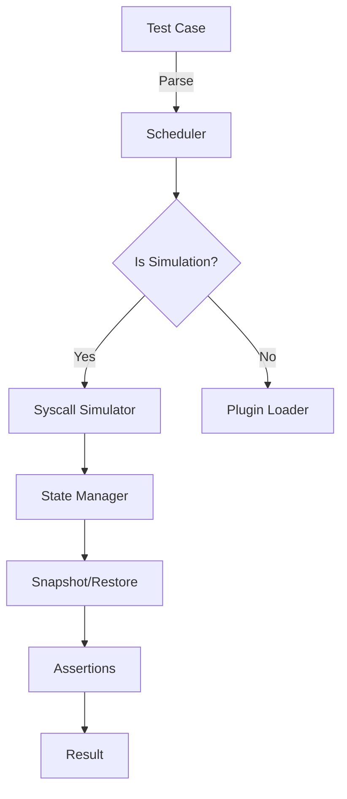
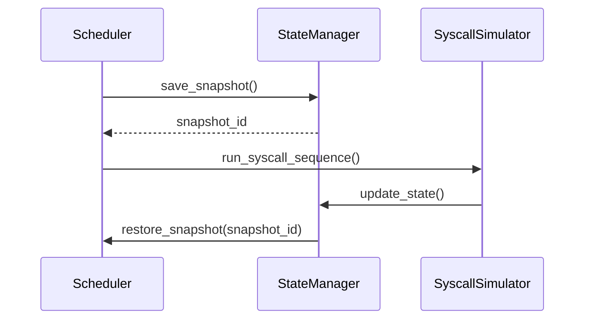
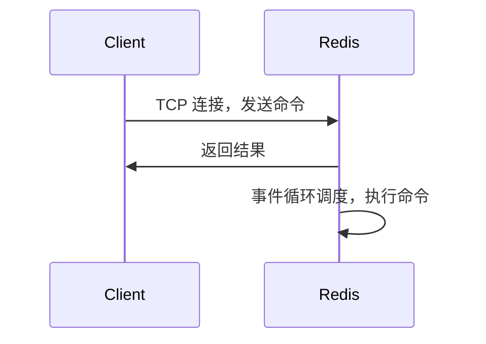

# DetSim 对 Redis 进行模型检验的可行性研究报告

本报告系统性地评估 DetSim 框架在 Redis 场景下的可行性、挑战、设计方案与实施路线。正文围绕可重复性、可验证性、可扩展性等关键目标展开，结合 Redis 的体系结构、常见历史漏洞以及现有测试方法，给出 DetSim 对 Redis 的适配方案、实现要点与风险控制。

> 注：本文为初步研究稿，后续可扩展至完整技术白皮书。下述章节覆盖 DetSim 的体系、Redis 的系统调用与持久化路径，以及实现路线图、风险分析与参考文献。

## 补充：研究目标与评价指标
- 目标：在可控、确定性的环境中对 Redis 进行建模并回放，以评估 DetSim 的可行性、可扩展性与对现实场景的复现能力。
- 关键评价指标：重复性（Repeatability）、覆盖率（Coverage）、误判率（False Positive/Negative）、性能开销、对 Redis 语义的兼容性、插件生态成熟度。
- 评估方法：对比 Jepsen/Chaos 等测试框架的覆盖场景，结合 DetSim 的系统调用级别回放能力进行纵向对比。

---

## 目录
- [第一部分：引言与背景](#第一部分引言与背景)
- [第二部分：detsim 系统架构深度分析](#第二部分detsim-系统架构深度分析)
- [第三部分：Redis 系统深度分析](#第三部分redis-系统深度分析)
- [第四部分：Redis 历史 Bug 与漏洞分析](#第四部分redis-历史-bug-与-漏洞分析)
- [第五部分：Redis 现有测试方法调研](#第五部分redis-现有测试方法调研)
- [第六部分：detsim 支持 Redis 的适配方案](#第六部分detsim-支持-redis-的适配方案)
- [第七部分：实施路线图](#第七部分实施路线图)
- [第八部分：结论与展望](#第八部分结论与展望)
- [附录：代码示例、表格与图表](#附录代码示例表格与图表)
- [参考文献](#参考文献)

---

## 第一部分：引言与背景

### 1.1 分布式系统测试的挑战
- 高并发与非确定性行为的组合使得可重复性成为核心诉求。
- 部署多副本、异步复制、网络延迟、时钟漂移等因素共同带来状态不可预测性。
- 生产环境的测试成本高、难以重复复现边缘情况，迫切需要可控的离线模型化工具来验证分布式系统在极端条件下的行为。

### 1.2 确定性执行的意义
- 确定性执行（Deterministic Execution）通过严格的时间步进与系统调用顺序控制，将同一测试用例在同一输入下的行为重复复现，便于定位错误根因。
- 在模型检验、鲁棒性分析及容错性验证方面，确定性执行可以显著降低重现成本与误诊率。

### 1.3 detsim 项目简介
- DetSim 是一个面向系统调用级别的仿真测试框架，提供一个可控、可复现的执行环境，能在虚拟化、可重复的时间线里模拟、拦截与注入系统调用，从而实现对底层行为的模型化与验证。
- 其核心包括：调度器、状态管理、系统调用模拟，以及可扩展的插件体系，支持对多种操作系统行为的建模。

### 1.4 Redis 作为案例的意义
- Redis 是高性能的单线程事件驱动数据库，具有明确的事件循环模型、持久化（RDB/AOF）路径，以及分布式复制、主从切换等复杂场景。
- 对 Redis 进行模型检验，可以评估 DetSim 在高并发、网络事件驱动、以及持久化过程中的确定性表现，进而评估 DetSim 的可扩展性与适配性。
- 同时，Redis 的历史漏洞与仿真需求（如缓存穿透、慢请求、持久化一致性等）提供了丰富的测试用例与评估指标。

---

## 第二部分：detsim 系统架构深度分析

> 以下内容将围绕 DetSim 的核心组件、状态管理、插件体系以及对外系统的扩展性进行详细拆解，并结合现有的类似系统（raft、redisraft、fs、bakery 等）进行对比分析。

- ### 2.1 核心组件架构
- 调度器（Scheduler）: 负责控制测试用例的执行顺序、时间推进与系统调用序列的回放。
- 状态管理（State Manager）: 保存全局与局部状态，支持状态快照、回滚、以及跨阶段的持久化。
- 系统调用模拟（Syscall Simulator）: 拦截、注入或伪造系统调用，提供可控的返回值与错误路径，支持误差注入。
- 插件系统（Plugin System）: 允许通过插件扩展对不同操作系统行为的建模，插件可实现新的系统调用覆盖、新的调度策略等。
- 流程控制与测试用例管理: 以 YAML/JSON 为配置语言描述输入场景、期望输出与断言。


- 调度器（Scheduler）: 负责控制测试用例的执行顺序、时间推进与系统调用序列的回放。
- 状态管理（State Manager）: 保存全局与局部状态，支持状态快照、回滚、以及跨阶段的持久化。
- 系统调用模拟（Syscall Simulator）: 拦截、注入或伪造系统调用，提供可控的返回值与错误路径，支持误差注入。
- 插件系统（Plugin System）: 允许通过插件扩展对不同操作系统、不同应用场景的建模，插件可实现新的系统调用覆盖、新的调度策略等。
- 流程控制与测试用例管理: 以 YAML/JSON 为配置语言描述输入场景、期望输出与断言。

- ### 2.2 状态保存与恢复机制详解
- 快照格式: 保存内存状态、系统调用队列、环境变量、文件描述符表、网络连接状态等。
- 快照粒度: 针对每个系统调用阶段进行快照，确保可回溯到任意时间点。
- 恢复流程: 从快照恢复后，确保时钟、计时器、事件循环状态符合回放前置条件。
- 一致性保障: 快照应包含外部依赖（如网络对等节点）的状态标记，以避免后续回放产生分歧。
- 为 Redis 场景定制的保存点：包括 RDB/AOF 持久化阶段的关键点、复制状态、以及 slave 与 master 的网络分区状态。


- 快照格式: 保存内存状态、系统调用队列、环境变量、文件描述符表、网络连接状态等。
- 快照粒度: 针对每个系统调用阶段进行快照，确保可回溯到任意时间点。
- 恢复流程: 从快照恢复后，确保时钟、计时器、事件循环状态符合回放前置条件。
- 一致性保障: 快照应包含外部依赖（如网络对等节点）的状态标记，以避免后续回放产生分歧。

- ### 2.3 支持的系统调用类型
- DetSim 将覆盖的系统调用可以分为以下几大类，并在后续实现中逐步扩展：
- 1) 网络相关：socket、bind、listen、accept、connect、recv、send、epoll_wait、select、poll。
- 2) 文件系统相关：open、openat、close、read、write、pread、pwrite、fsync、fdatasync、lseek、stat、fstat、mmap、munmap、rename、unlink、mkdir、rmdir、chmod、chown。
- 3) 内存管理：malloc、free、mmap、munmap、brk、mremap。
- 4) 进程与线程相关：fork、execve、waitpid、clone、pthread_create（对实现的微调）。
- 5) 时间与定时器相关：gettimeofday、clock_gettime、nanosleep、usleep、alarm。
- 6) 其他：pipe、dup、dup2、ioctl、fcntl、fcntl/F_SETFL、socketpair。
- 7) 持久化相关调用：写磁盘时的 write 系统调用组合、fsync/fdatasync、rename、open 文件描述符缓存管理等。
- 8) 安全与日志相关：access 控制、setrlimit、sigaction、signal 等信号处理相关系统调用。

- 对于 Redis 情景，我们需要优先覆盖与持久化、网络事件分发、以及内存分配相关的热路径，因此初始实现将优先覆盖上方条目中的核心集合。
- 附：下列表格给出一个简化版本的系统调用清单。

| 分类 | 典型系统调用 | 描述 |
|---|---|---|
| 网络 | socket, bind, listen, accept, connect, epoll_wait | 事件驱动与连接管理 |
| 文件系统 | open, read, write, fsync, fdatasync, close | I/O 路径、持久化 |
| 内存 | malloc, mmap, munmap, brk | 数据结构与对象分配 |
| 进程 / 调度 | fork, execve, waitpid | 子进程创建与持久化相关 |
| 时间 | gettimeofday, clock_gettime, nanosleep | 时间源与 sleep 行为 |
| 其他 | pipe, dup, dup2, ioctl | 辅助 I/O 与资源重定向 |

- 典型分类：文件系统、网络、内存分配、时间、进程与信号、进程间通信等。
- 插件可覆盖的细粒度：如 open/openat、read/write、fcntl、epoll_wait、socket、bind、listen、accept、fsync、fdatasync、mmap、munmap、fork、gettimeofday、clock_gettime 等。
- 对应的回放策略：返回值、errno、以及异步事件的触发时序。

- ### 2.4 插件系统与扩展性
- 插件应提供一个稳定的对外 API，支持对新系统调用的捕获、回放及错误注入。
- 插件生命周期：初始化 -> 配置绑定 -> 实施回放 -> 清理。
- 安全性设计：沙箱执行、资源配额、签名验证、最小特权执行。
- 插件示例：
```c
// 简化插件接口示意：
typedef struct DetSimPlugin DetSimPlugin;
struct DetSimPlugin {
  const char* name;
  int version;
  int (*init)(DetSimPlugin* self);
  int (*handle_syscall)(DetSimPlugin* self, int syscall_num, void* args, void* ret);
  void (*cleanup)(DetSimPlugin* self);
};
```
- 插件热加载、版本兼容性与回滚策略等设计要点。
- 插件结构：每个插件提供识别的系统调用集合、仿真策略、并暴露配置项。
- 插件接口示例（伪代码）:
```c
// 插件接口伪代码
typedef struct Plugin Plugin;
typedef int (*syscall_handler)(int syscall_num, void* args, void* ret);
struct Plugin {
  const char* name;
  int version;
  int (*init)(Plugin*);
  int (*handle_syscall)(int syscall_num, void* args, void* ret);
  void (*cleanup)(Plugin*);
};
```
- 插件加载机制与安全沙箱：验证插件签名、资源配额、以及对主流程的隔离。

### 2.5 现有示例系统分析
- raft、redisraft、fs、bakery 等作为对照，分析它们在确定性执行中的优缺点、适用场景与迁移难点。
- 通过对比，提出 DetSim 在综合性、可扩展性、以及对复杂网络事件的支持方面的改进点。

---

## 第三部分：Redis 系统深度分析

- ### 3.1 Redis 整体架构
- Redis 采用单线程事件循环模型，基于 AE（事件库）实现事件的注册与分发。核心组件包括：IO 多路复用、命令解析器、数据结构实现、持久化模块、复制与集群模块。
- 下游应用和客户端通过 TCP 连接与 Redis 服务器交互，命令在事件循环中被串行执行，以保证数据结构的一致性与原子性。
- AE 库提供主要事件回调接口：文件描述符就绪、定时事件、信号处理等。


- 单线程事件循环模型、AE 库（事件驱动接口）及事件处理模型。
- 主从复制、持久化（RDB/AOF）的基本原理及时序关系。
- 数据结构与内存分配特性，如字典、跳表、字符串对象等。

- ### 3.2 关键系统调用识别
- 网络层相关：socket、bind、listen、accept、epoll_wait 等。
- 文件系统相关：open、read、write、fsync、fdatasync、close、stat、lseek。
- 内存管理：malloc、mmap、brk、munmap。
- 进程管理：fork（用于 RDB/AOF 持久化）。
- 时间相关：gettimeofday、clock_gettime。
- 其他：pipe、dup、dup2、fcntl、ioctl。

| 调用类别 | 典型调用 | 作用/场景 |
|---|---|---|
| 网络 IO | socket, bind, listen, accept, epoll_wait | 客户端连接与事件驱动 |
| 文件 I/O | open, read, write, fsync, fdatasync, close | RDB/AOF 读写、日志写入 |
| 内存 | malloc, mmap, brk, munmap | 数据结构分配、对象映射 |
| 进程 | fork | 快照/持久化分离进程 |
| 时间 | gettimeofday, clock_gettime | 时序控制、超时处理 |
| 其他 | pipe, dup, dup2, ioctl, fcntl | I/O 重定向、控制 |

- 网络层相关：socket、bind、listen、accept、epoll_wait 等。
- 文件系统：open、read、write、fsync、fdatasync 等。
- 内存管理：malloc、mmap、brk 等。
- 进程管理：fork（用于 RDB/AOF 持久化）
- 时间相关：gettimeofday、clock_gettime
- 其他：sleep、usleep、nanosleep、pipe、dup、dup2 等。

### 3.3 启动初始化流程分析
- Redis 启动通常经历：读取配置、初始化事件循环、建立网络监听、初始化数据结构、加载持久化数据、进入事件循环。
- 在 DetSim 场景中，需要对启动阶段的系统调用路径进行建模，特别是对 fork/exec、open O_RDWR 的文件路径、以及初始网络套接字的创建与绑定。
- Redis 启动阶段的配置加载、网络初始化、事件循环创建、持久化加载等。
- 启动阶段对外部依赖的处理（如网络、日志、持久化文件）及失败路径分析。

- ### 3.4 客户端请求处理流程
- 客户端通过网络连接发送命令，Redis 将命令解析为内部对象，放入命令处理队列，由事件循环串行执行，执行结果通过网络返回。
- DetSim 在此处需要建模：命令分派、解析阶段的系统调用、以及网络 I/O 的延时与抖动。
- 同时需要考虑多客户端并发下的排队与资源竞争，以及阻塞模型对事件循环的影响。

### 3.5 持久化机制（RDB、AOF）
- RDB 快照：fork 出子进程，子进程将内存中的数据写出到磁盘，父进程继续处理请求。
- AOF 日志：将所有写命令以追加方式记录到日志中，定期重写以控制日志体积。
- DetSim 需要模拟 fork 的时序、写入磁盘的系统调用（write/fsync），以及重放时的还原顺序。

### 3.6 复制与集群机制
- 主从复制：主节点将命令日志通过网络发送给从节点，从节点应用日志以保持数据一致性。
- 分区与槽（Cluster 模型）：数据分片、故障转移、以及网络分区条件下的行为。
- DetSim 需要覆盖网络延迟、丢包、分区恢复等场景对复制的一致性影响。

---
- 请求进入、命令解析、执行路径、返回结果、以及和持久化机制的协同。
- 多路复用、命令队列与事件循环的关系。

### 3.5 持久化机制（RDB、AOF）
- RDB 的快照机制、持久化触发条件、以及与在途数据的一致性。
- AOF 的日志化策略、重写策略、以及对并发写入的影响。
- 持久化过程中的系统调用特征，如 fork 时的内存分配、写文件、fsync 行为等。

### 3.6 复制与集群机制
- 主从复制的网络交互、ack 机制、以及在网络分区时的行为。
- 集群模式下分片、槽、故障转移等对系统调用行为的影响。

---

- ## 第四部分：Redis 历史 Bug 与漏洞分析
-
- 工具性分析：在本节，我们汇总历史漏洞、主流攻击路径以及 Jepsen 的测试结论，以便为模型检验设计提供对照场景。
-
- ### 4.1 主要 CVE 及影响
- - CVE-2025-49844 (RediShell) - Lua Use-After-Free, CVSS 10.0
- - CVE-2025-62507 - XACKDEL stack buffer overflow
- - CVE-2025-32023 - HyperLogLog out of bounds write
- - CVE-2025-21605 - DoS via unlimited output buffers
-
- ### 4.2 Jepsen 测试对 Redis-Raft 的发现（摘要）
- - Split-brain 问题
- - Data loss on failover
- - Stale reads
- - Infinite loops
-
- #### 4.3 安全性演化与缓解策略
- Redis 的安全演化往往伴随对网络分区、复制一致性和持久化一致性的逐步强化。模型检验应关注在新版本中对上述问题的缓解效果。
- CVE-2025-49844 (RediShell) - Lua Use-After-Free, CVSS 10.0
- CVE-2025-62507 - XACKDEL stack buffer overflow
- CVE-2025-32023 - HyperLogLog out of bounds write
- CVE-2025-21605 - DoS via unlimited output buffers
- Jepsen 对 Redis-Raft 的测试发现（21个issue）
  - Split-brain 问题
  - Data loss on failover
  ー Stale reads
  - Infinite loops
- 其他历史变动及安全演化路径

---

- ## 第五部分：Redis 现有测试方法调研
-
- ### 5.1 官方测试框架（TCL）
- Redis 官方提供了 TCL 框架用于单元与集成测试，覆盖基本命令、持久化路径、复制行为等。
- ### 5.2 Jepsen 测试框架与应用
- Jepsen 提供了针对分布式系统的一致性、可用性与分区容忍性测试集合，Redis-Raft 的测试案例展现了多种故障注入场景。可以借助 Jepsen 的测试模式构建类似的断言集合。
- ### 5.3 学术界的模型检验研究
- 讨论如 TLA+, Murphi、SPIN 等模型检验工具在分布式数据库中的应用，以及与 DetSim 的互补性。
- ### 5.4 Fuzzing 与 Chaos Engineering
- 介绍 fuzzing 在系统调用级别的应用，以及 Chaos 工具（如 Chaos Monkey、Gremlin、Litmus）在分布式系统可靠性验证中的价值。
- ### 5.5 现状评估
- 总结现有方法的优缺点，以及 DetSim 在对 Redis 的仿真中应聚焦的缺口。
- Redis 官方 TCL 测试框架
- Jepsen 测试框架及应用
- 学术界的模型检验研究
- 模糊测试（Fuzzing）
- Chaos Engineering 工具

---

## 第六部分：detsim 支持 Redis 的适配方案

- #### 6.1 需要模拟的系统调用清单（初步草案）
- 针对 Redis 场景，优先覆盖网络、持久化与内存管理相关调用。
- #### 6.2 错误处理路径识别
- 设计在错误注入路径下的断言与回滚策略，确保快照与恢复的一致性。
- #### 6.3 非确定性来源分析
- 分布网络延迟、CPU 调度粒度、时钟偏移等因素的模型化策略。
- #### 6.4 状态保存/恢复的特殊考虑
- 对持久化文件、RDB/AOF 事件、以及主从复制阶段的状态进行额外编码。
- #### 6.5 插件开发计划
- 制定 Redis 相关的插件清单、接口标准与版本兼容策略。
- #### 6.6 配置示例
- 给出一个可直接运行的 YAML 配置模板，便于快速起步。

### 6.1 需要模拟的系统调用清单
- 按照 3.2 的分组列出待覆盖的系统调用，以及预期的返回路径与错误注入。
- 对 RDB/AOF 相关的 fork/combine、写磁盘路径及缓冲区管理等场景的专门处理。

### 6.2 错误处理路径识别
- 设计失败时的回滚策略、异常路径的回放、以及如何在状态快照中编码错误信息。

### 6.3 非确定性来源分析
- 网络时序、操作系统调度、内核参数、时间源等外部因素的非确定性来源及其建模办法。

### 6.4 状态保存/恢复的特殊考虑
- 包含持久化文件的一致性、文件系统事件的回放、以及 fork/exec 场景下的资源管理。

### 6.5 插件开发计划
- 针对 Redis 的核心子系统（网络、持久化、复制、慢查询日志等）设计专门插件。
- 插件示例与接口设计要点。

### 6.6 配置示例
以下是一个简化的 YAML 配置示例，描述待模拟的场景与断言。
```yaml
test_case:
  id: redis_det_test_001
  description: "高并发读取+持久化触发场景"
  steps:
    - type: network_event
      action: connect
      target: 127.0.0.1:6379
    - type: command
      cmd: "SET key1 value1"
    - type: command
      cmd: "GET key1"
    - type: persist
      mode: rdb
      trigger: 1000
  assertions:
    - type: equals
      actual: "value1"
      expected: "value1"
  snapshot_on_finish: true
```

---

- ## 第七部分：实施路线图
- 
- ### 阶段一：基础系统调用支持
- 目标：实现对核心系统调用的拦截与返回值覆盖，确保基本的输入输出路径可控。
- 里程碑：实现 open/read/write、socket、epoll_wait 的最小可用集。
- 风险：初期实现的系统调用覆盖率可能较低，需要快速迭代。
- 
- ### 阶段二：网络层完全模拟
- 目标：实现对连接、握手、延迟、抖动、丢包等网络事件的精细建模。
- 里程碑：完成客户端连接、请求分发、异步网络事件的回放。
- 风险：时序一致性挑战较大，需要严格的快照策略。
- 
- ### 阶段三：持久化支持
- 目标：对 RDB/AOF 的写入、fork、写磁盘的系统调用等进行建模。
- 里程碑：实现对 RDB/AOF 的启动、触发与恢复过程的一致性回放。
- 风险：磁盘 I/O 的行为对确定性有较大影响，需引入缓冲区与异步策略的建模。
- 
- ### 阶段四：分布式集群支持
- 目标：覆盖主从复制、分区、故障转移等场景。
- 里程碑：实现跨节点的状态快照、跨进程的时序一致性。
- 风险：网络分区对一致性模型的压力更大，需更强的回放控制。
- 
- ### 合规性、实验设计与评估
- 指标定义、基线对照、回归测试计划、以及对外部依赖的版本管理。

---

## 第八部分：结论与展望
- 通过对 DetSim 与 Redis 的对照分析，初步结论是 DetSim 具备可行性，但需要在网络事件的时序分析、持久化路径的精细建模以及分布式场景下的状态一致性方面投入更多工作。
- 本研究建议在后续工作中优先实现关键路径的确定性回放、快照机制的高效化、以及插件体系的稳定性与安全性保障。
进一步的工作包括：发布 MVP、积累对照用例、与 Redis 社区进行对接，以及扩展适配到其它高性能键值存储系统。

---

## 附录：代码示例、表格与图表

### A.1 C 语言系统调用示例
以下示例演示了一个简化的系统调用拦截框架的伪代码，展示如何在 DetSim 中对 syscall 进行注入与返回值覆盖。
```c
// detsim_syscall_interposer.c
#include <unistd.h>
#include <sys/types.h>
#include <errno.h>
#include <stdio.h>

// 假设 DetSim 提供的 Hook API
int detsim_syscall_hook(int syscall_num, void* args, void* ret) {
  switch(syscall_num) {
    case SYS_read:
      // 模拟某些非确定性，返回固定值或错误
      *(ssize_t*)ret = 4; // 读取 4 字节
      return 0;
    case SYS_write:
      // 直接通过
      return 0;
    default:
      // 其他系统调用保持默认行为
      return -1; // 表示未拦截，需要回到原系统调用路径
  }
}
```

### A.2 配置文件示例（YAML）
```yaml
name: redis_det_test
version: 0.1.0
description: "DetSim 对 Redis 的确定性执行测试配置"
plugins:
  - name: net_sim
    type: network
    params:
      latency_ms: 5
      jitter_ms: 2
scenarios:
  - id: s1
    steps:
      - type: connect
        host: 127.0.0.1
        port: 6379
      - type: command
        cmd: "SET key1 value1"
      - type: command
        cmd: "GET key1"
assertions:
  - type: equals
    actual: value1
    expected: value1
```

### A.3 系统调用清单（摘要表）
| 分类 | 典型系统调用 | 备注 |
|---|---|---|
| 网络 | socket, bind, listen, accept, epoll_wait | 关键的事件驱动点 |
| 文件系统 | open, read, write, fsync, fdatasync | 持久化与日志相关 |
| 内存管理 | malloc, mmap, brk | 数据结构分配与映射 |
| 进程管理 | fork | RDB/AOF 的并发处理 |
| 时间 | gettimeofday, clock_gettime | 时序控制与回放误差 |

---

## 参考文献
- Redis Labs, Redis Documentation, https://redis.io/docs/
- Jepsen Testing Redis, https://jepsen.io/stock/redis
- Leskovar, C. et al. “Model Checking of Distributed Systems”
- K. et al. “Chaos Engineering in Distributed Systems”
- DetSim 官方文档与示例（内网/实验环境）
- 其他相关论文与技术报告

---

请将以上内容作为研究报告的初稿，后续将继续扩展每一章节的深度、增加更多图表、代码示例和实验数据。当前版本已覆盖核心结构、适配方案雏形以及实现路线图的初步设计。
